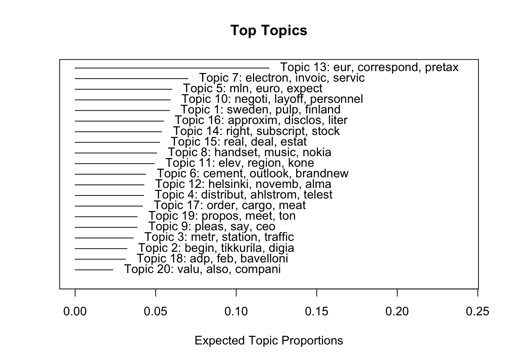
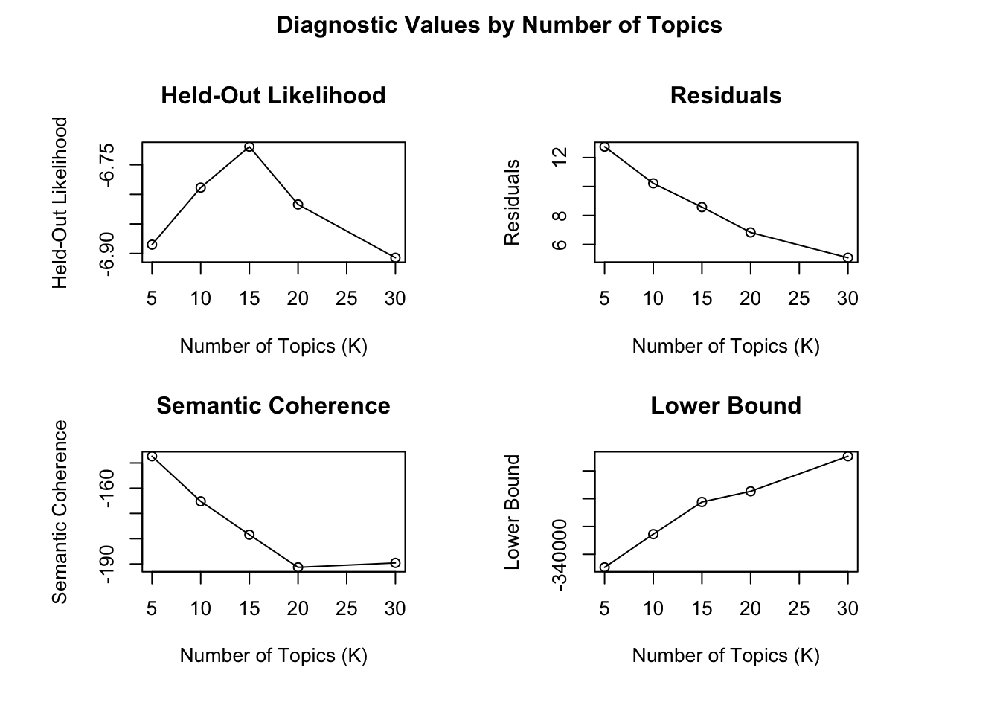
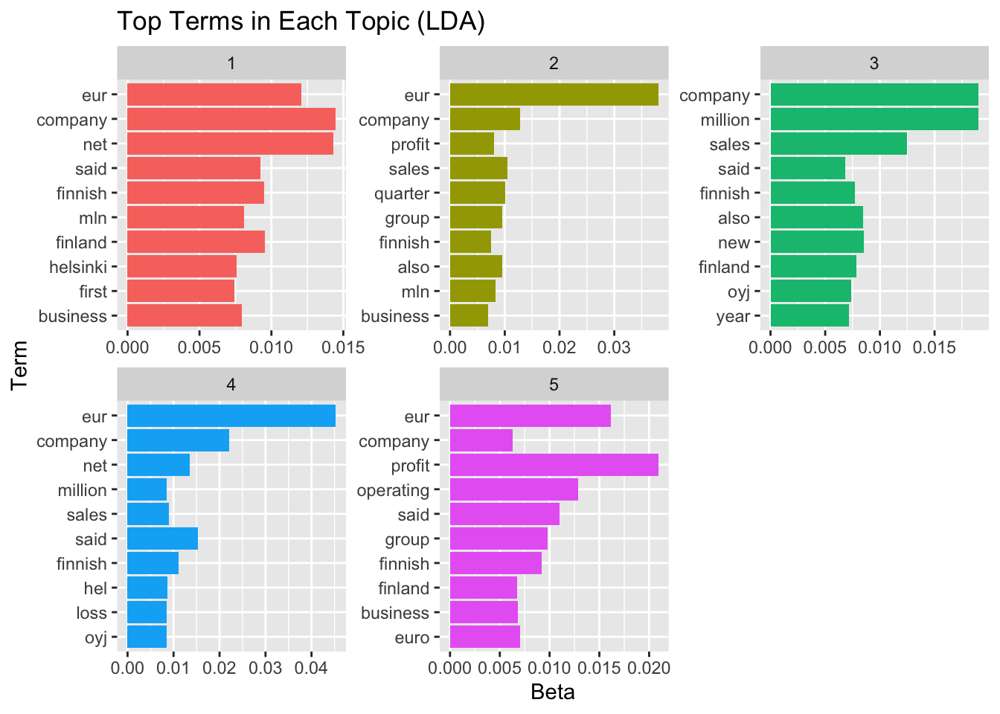

# financial-text-analysis-nlp
This project evaluates whether machine learning models can effectively capture sentiment in financial language, which is often neutral and context-dependent.
# Sentiment and Topic Analysis of Financial Headlines (R)

## 📊 Example Outputs

### STM Topics

### Topic Selection Diagnostics

### LDA Topics

## 📌 Overview
This project applies a comprehensive Natural Language Processing (NLP) pipeline to financial news headlines using the Financial PhraseBank dataset. The goal is to extract meaningful insights from financial text and evaluate the performance of different machine learning models in sentiment classification.

The project combines both **unsupervised learning methods** (topic modeling and embeddings) and **supervised classification models** to analyze sentiment and structure in financial language.

## 🔍 Research Question

Do machine learning models systematically misclassify positive financial news as neutral, given the typically neutral and nuanced language of financial reporting?

## 🎯 Objectives
- Identify dominant themes using **LDA** and **Structural Topic Modeling (STM)**
- Explore semantic relationships using **GloVe embeddings** and **t-SNE visualization**
- Train and compare classification models:
  - Naive Bayes
  - Random Forest
  - XGBoost
- Evaluate performance using:
  - Accuracy
  - Precision
  - Recall
  - Confusion Matrix
- Explore the potential of **LLMs** for improving interpretability

---

## 📊 Dataset
- **Source:** Financial PhraseBank  
- ~4,800 financial news headlines  
- Labels: *positive, negative, neutral*  
- Expert-annotated by finance professionals  

---

## ⚙️ Methodology

### 1. Preprocessing
- Lowercasing
- Stopword removal
- Tokenization
- Noise removal (punctuation, numbers)

---

### 2. Unsupervised Learning
- **LDA (Latent Dirichlet Allocation):** Topic extraction  
- **STM (Structural Topic Modeling):** Topic prevalence and structure  
- **GloVe embeddings:** Semantic representation of words  
- **t-SNE:** Visualization of word relationships  

---

### 3. Supervised Learning
Models used:
- Naive Bayes  
- Random Forest  
- XGBoost  

Text representation:
- TF-IDF  

Validation:
- Train/Test split  
- Cross-validation  

---

## 📈 Key Results

- **XGBoost** achieved the highest performance:
  - Accuracy ≈ **74%**
- **Random Forest**:
  - Accuracy ≈ **72%**
- **Naive Bayes** performed significantly worse

### Key Insights:
- Neutral financial language is easier to classify than positive/negative sentiment  
- Financial text is short and lexically dense  
- Vocabulary overlap reduces classification performance  
- Topic models successfully capture financial and corporate themes  

---

## 🤖 LLM Application
A small experiment was conducted using LLMs (e.g., ChatGPT) to summarize financial headlines.

### Findings:
- LLMs improved interpretability  
- Generated summaries aligned well with sentiment labels  
- Demonstrated potential for integration into financial reporting tools  

---

## ⚠️ Limitations
- Class imbalance affected recall  
- Short text length limits model expressiveness  
- GloVe trained on relatively small corpus  
- LLM integration not fully automated  

---

## 🚀 Future Improvements
- Apply **SMOTE / class weighting**  
- Use **transformer models (BERT, RoBERTa)**  
- Automate LLM integration via API  
- Improve model explainability (SHAP, LIME)  

---

## 🛠️ Technologies Used
- R  
- tidyverse  
- quanteda  
- stm  
- topicmodels  
- text2vec  
- tidymodels  
- xgboost  
- ranger  

---

## 📎 Project Structure

---

## 👤 Author
**Hatice Banu Yildirim**  
MSc Finance & Money – University of Basel  
Focus: Data-driven financial analysis, time series, NLP, and cryptocurrency markets  

---

## 📌 Note
This project was developed as part of a graduate-level course in text analysis.  
All analysis, modeling, and interpretation were independently implemented and validated.
